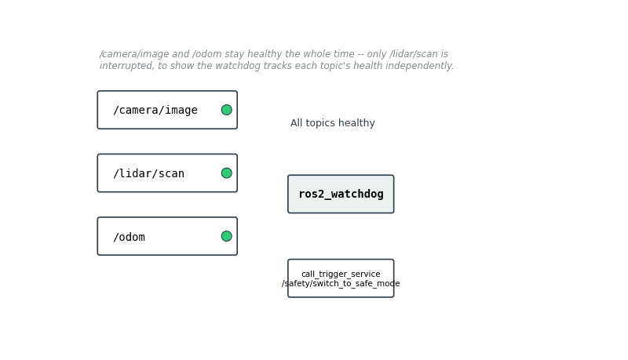
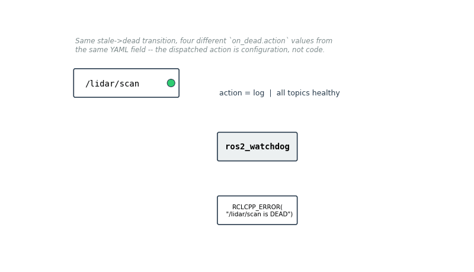
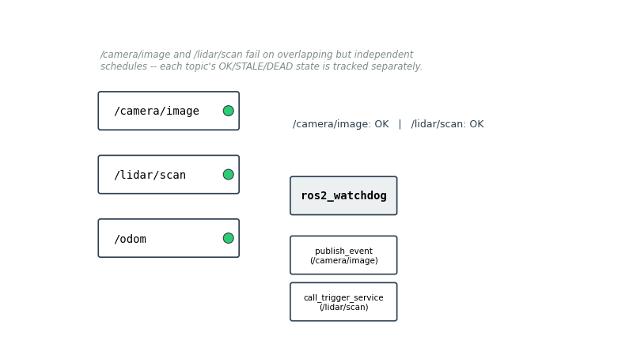
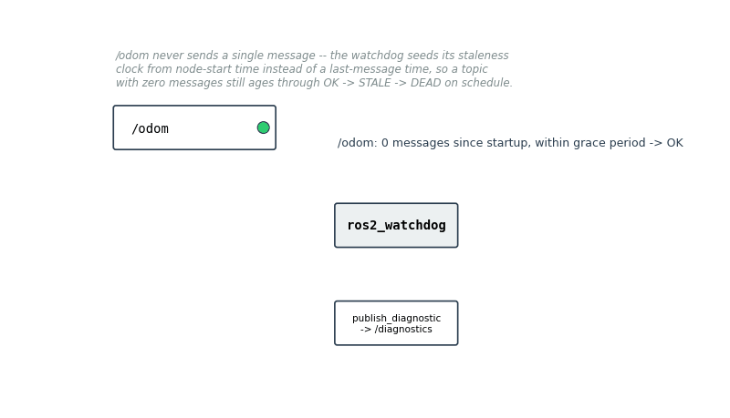

# ros2_watchdog

A generic, config-driven health watchdog for ROS2 robot stacks. Monitor any topic's
rate and staleness, and declare what should happen when it fails — log it, raise a
diagnostic, call a failover service, or publish a health event — all via YAML,
with zero code changes per robot.

### What it actually does

Four short scenarios, each isolating one behavior of the watchdog:

**1. A single topic fails and recovers, while others stay healthy**
`/camera/image` and `/odom` never change — they're there so you can see the
watchdog tracks `/lidar/scan`'s health independently of the rest of the system,
not as a global "is anything wrong" flag.



**2. The same failure, routed through four different configured actions**
Nothing here is hardcoded — `log`, `publish_diagnostic`, `publish_event`, and
`call_trigger_service` are all the same `on_dead.action` YAML field taking a
different value. Choosing what happens on failure is a config decision per
topic, not a code change.



**3. Two topics fail on overlapping but independent schedules**
`/camera/image` and `/lidar/scan` go stale and dead at different, overlapping
times. Each topic has its own `OK → STALE → DEAD` state machine and dispatches
its own configured action — one topic failing doesn't block or delay detection
of the other.



**4. A topic that never publishes at all**
`/odom` never sends a single message after the node starts, so there's no
last-message timestamp to measure staleness against. The watchdog seeds its
staleness clock from node-start time instead, so a topic with zero messages
still ages through `OK → STALE → DEAD` on the normal schedule rather than
being silently treated as healthy forever just because it has no history yet.



All four GIFs are generated, not recorded — see
[`tools/anim/generate_explainer_gifs.py`](tools/anim/generate_explainer_gifs.py)
to regenerate them after changing the wording or scenarios.

## Why this exists

Every ROS2 stack eventually needs topic health monitoring, and most teams write a
half-version of it ad hoc — a script polling `ros2 topic hz` in a loop, or scattered
timeout checks bolted onto individual nodes. The pieces that already exist in the
ecosystem solve adjacent problems but not this one:

| Package | What it does | What it doesn't do |
|---|---|---|
| `diagnostic_aggregator` | Aggregates self-reported health from nodes that opt in | Passive — nodes must publish their own diagnostics; no rate/staleness detection, no response actions |
| `bond` | Process-pair liveness heartbeat | No rate or staleness monitoring of arbitrary topics; no configurable failure response |
| Nav2 `lifecycle_manager` | Manages lifecycle transitions for Nav2's own nodes | Scoped to Nav2 only, not a general-purpose topic watchdog |
| **ros2_watchdog** | Monitors arbitrary topics for rate/staleness **and** dispatches configurable actions on failure | — |

The differentiator is the **action layer**: instead of just detecting that
`/lidar/scan` died, you declare in YAML that it should call `/safety/switch_to_safe_mode`
(a `std_srvs/Trigger` service) — no failover logic hardcoded into this package, and no
code to write or rebuild per robot.

## Quickstart

```bash
cd ~/claude/ros2/ros2_watchdog
colcon build --packages-select ros2_watchdog
source install/setup.bash

ros2 launch ros2_watchdog watchdog.launch.py \
  params_file:=$(pwd)/install/ros2_watchdog/share/ros2_watchdog/config/watchdog_params.yaml
```

This launches the watchdog as a lifecycle node and auto-transitions it straight to
`ACTIVE`. It will start monitoring whatever topics are listed in the params file
(see [`config/watchdog_params.yaml`](config/watchdog_params.yaml) for a realistic
lidar/camera/odom example).

## Demo walkthrough

```bash
# Terminal 1: launch the watchdog with a fast demo config
ros2 launch ros2_watchdog watchdog.launch.py \
  params_file:=$(pwd)/install/ros2_watchdog/share/ros2_watchdog/config/demo_params.yaml

# Terminal 2: watch health events
ros2 topic echo /watchdog/events

# Terminal 3: run the failure simulator (publishes, then goes silent for 3s)
ros2 run ros2_watchdog demo_failure_sim.py
```

You'll see the topic go `OK -> STALE -> DEAD`, a diagnostic + health event fire, and
then `RECOVERED` once the simulator resumes publishing — the same sequence shown in
the animation above.

## Config reference

Each monitored topic is declared under `monitored_topics` with a short key (used only
to namespace its parameters):

| Parameter | Type | Description |
|---|---|---|
| `monitored_topics` | `string[]` | List of topic keys to monitor |
| `monitored_topics.<key>.topic` | `string` | Topic name to subscribe to |
| `monitored_topics.<key>.type` | `string` | Message type, e.g. `sensor_msgs/msg/LaserScan` |
| `monitored_topics.<key>.expected_rate_hz` | `double` | Expected publish rate (`0` disables rate checking, staleness-only) |
| `monitored_topics.<key>.rate_tolerance_ratio` | `double` | Allowed fractional deviation below the expected rate before going `STALE` |
| `monitored_topics.<key>.staleness_timeout_sec` | `double` | No message for this long → `STALE` |
| `monitored_topics.<key>.dead_timeout_multiplier` | `double` | `STALE` for `staleness_timeout_sec * this` → `DEAD` |
| `monitored_topics.<key>.actions` | `string[]` | Any of `log`, `publish_diagnostic`, `publish_event`, `call_trigger_service` |
| `monitored_topics.<key>.trigger_service` | `string` | Service name for `call_trigger_service` (must be `std_srvs/srv/Trigger`) |
| `monitored_topics.<key>.notify_on_recovery` | `bool` | Also fire `log`/`publish_diagnostic`/`publish_event` actions when the topic recovers to `OK` |
| `monitored_topics.<key>.qos_reliability` | `string` | `best_effort` (default) or `reliable`. Defaults to `best_effort` because a best-effort *subscriber* is QoS-compatible with both best-effort and reliable publishers — a reliable subscriber against a best-effort sensor driver (the common case for lidar/camera) would silently fail to connect |
| `monitored_topics.<key>.qos_durability` | `string` | `volatile` (default) or `transient_local` — must match the publisher for latched/static topics |
| `monitored_topics.<key>.qos_depth` | `int` | Subscription queue depth, default `10` |

## Architecture

```
┌─────────────────┐     ┌─────────────────────┐     ┌─────────────────────┐
│                 │     │                     │     │ TopicMonitor (FSM)  │
│ Monitored Topic │ --> │ GenericSubscription │ --> │ OK -> STALE -> DEAD │
└─────────────────┘     └─────────────────────┘     └─────────────────────┘
                                                               |
                                                               | on state transition
                                                               v
                                                     ┌──────────────────┐
                                                     │ ActionDispatcher │
                                                     └──────────────────┘
                                                               |
                                                               | dispatches any combination of:
                                                               +-- log
                                                               +-- publish_diagnostic
                                                               +-- publish_event
                                                               +-- call_trigger_service
```

- `TopicMonitor` is pure C++ logic with no ROS dependency — it just tracks wall-clock
  arrival gaps and a rolling rate estimate, so it's unit-tested in isolation.
- Subscriptions use `rclcpp::GenericSubscription`, so the watchdog never needs the
  monitored topics' message types at compile time and never deserializes payloads —
  only arrival timestamps matter.
- `ActionDispatcher` is a simple type-switch, not a plugin framework — four action
  types cover what a YAML config needs to express.

## Testing

```bash
colcon test --packages-select ros2_watchdog
colcon test-result --verbose
```

- `test_topic_monitor`: gtest unit tests for the state machine (no ROS runtime).
- `test_watchdog_lifecycle`: `launch_testing` integration test — launches the real
  node, publishes/stops publishing to a test topic, and asserts a `HealthEvent`
  appears within the configured staleness window.

## Roadmap

- Node-process liveness via `bond`, not just topic activity
- Header-timestamp-based staleness (currently wall-clock arrival time only)
- Small web dashboard subscribing to `/watchdog/events`

## License

MIT — see [LICENSE](LICENSE).
